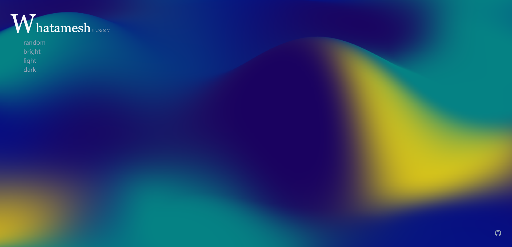

# Whatamesh 💦

## Screenshots

## To do

- [ ] Settings page `ref.current`
- [ ] Splitting code :v

## Bugs

- [ ] [unknown](/src/components/Whatamesh.jsx#L120)

Inspired by [`@jordienr`](https://github.com/jordienr/whatamesh)
