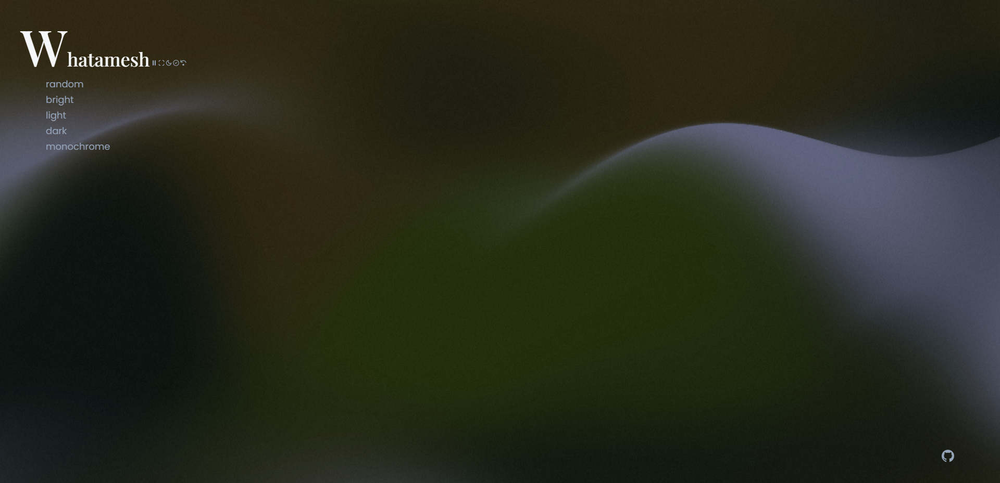

# Whatamesh 💦

## Screenshots



## To do

- [ ] Add more options [`ref1.current`](src/components/Whatamesh.jsx#L26)
- [ ] [`Code splitting`](https://reactjs.org/docs/code-splitting.html)
- [ ] Keyboard shortcut
- [ ] Screenshot function [`html2canvas`](https://html2canvas.hertzen.com/)
- [ ] Use `@next/font` instead of `tailwindcss` 🤡

## Bugs

- [ ] Responsive layout `Footer(GitHub icon)`

## Tree files

```text
📂README
 ┗ 📂images
 ┃ ┗ 📂screenshots
 ┃ ┃ ┗ 0.png

📂src
 ┣ 📂components
 ┃ ┗ 📂Whatamesh
 ┃ ┃ ┣ index.jsx
 ┃ ┃ ┗ noise.gif
 ┣ 📂css
 ┃ ┣ index.scss
 ┃ ┣ _google-font.scss
 ┃ ┗ _tailwindcss.scss
 ┣ 📂library
 ┃ ┗ Gradient.js
 ┣ App.jsx
 ┣ App.scss
 ┗ main.jsx
```

## Development

```text
 _______________
/ $ mpm i       \
\ $ npm run dev /
 ---------------
        \   ^__^
         \  (oo)\_______
            (__)\       )\/\
                ||----w |
                ||     ||
```

Inspired by [`@jordienr`](https://github.com/jordienr/whatamesh)
